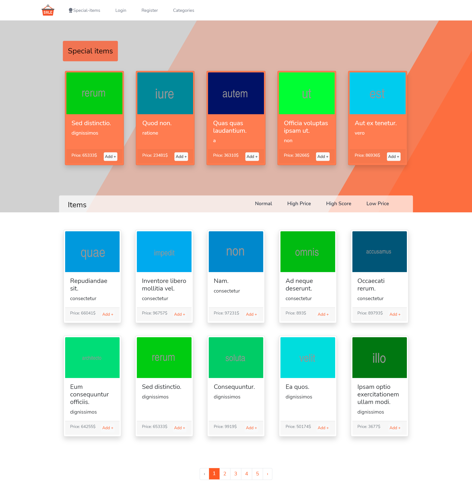
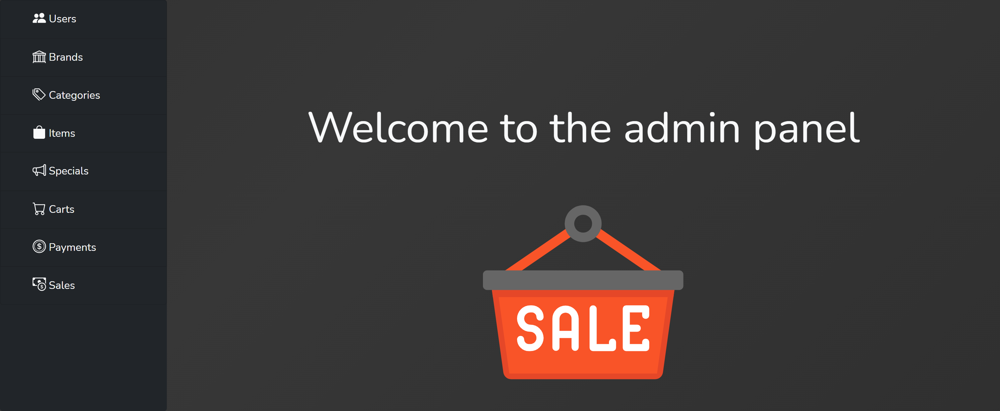

# Online Shop

M-54 Bootcamp final project.<br />
Modeling digikala website with PHP/Laravel. 

Creating a simple WooComers website with Laravel and Blade.

<p align="center">





</p>

## Tools
- Laravel 8
- PHP 7
- MySQL 5
- Redis
- HTML 5
- CSS 3
- Bootstrap 5
- Javascript
- Blade

## About website parts
- WooComers website
- Full access Admin panel
- Notification panel 
- User panel 

In this project I used all the important tools to make a laravel website.<br />
Some project features are:
- Storage management 
- Notifications
- Emails and SMS
- Rest APIs

By using the MVC architecture, I used the Eloquent models and Resource Controllers to create my routes and models. And for the view
parts I used the simple Blade templating.

## Code Features
- Eloquent models
- Authentication 
- Gate and Policy
- Resource Controllers
- Middlewares
- Service Providers 
- Enums 
- Jobs and Queue
- Observers 
- Blade Components
- Exceptions
- Files and Storage 
- API 
- Resource and Collections
- View routes
- Resource routes
- Form requests 
- Seeder and Factory 
- SQL Migrations 
- Js Axios 
- jQuery 
- DOM

## How to run project
First clone into the repository:
```shell 
git clone https://github.com/amirhnajafiz/Online-Shop.git
```

Then go into the root directory of the project:
```shell 
cd digikala-sample
```

Now reload the composer:
```shell
composer dump
```

Now create the database and set <b>.env</b> file based on your information and system.<br />
Now run the database migrations:
```shell
php artisan migrate --seed --step
```

Ok now we need to set up the font-end:
```shell
npm i & npm run dev
```

After that enter the following command to start the server:
```shell
php artisan serve
```

If you get something like this, then you are good to go:
```shell
Starting Laravel development server: http://127.0.0.1:8000
[Wed Oct 27 20:53:24 2021] PHP 8.0.7 Development Server (http://127.0.0.1:8000) started
```

### Final word

Special thanks to <b>M54 Bootcamp</b>.<br />
And my dear teacher, <b>Mr.Ehsan Kashfi</b><br />
Also special thanks to my lovely mentor <b>Mr.Omid KheirAbadi</b><br />

Amirhossein Najafizadeh, 27th October 2021