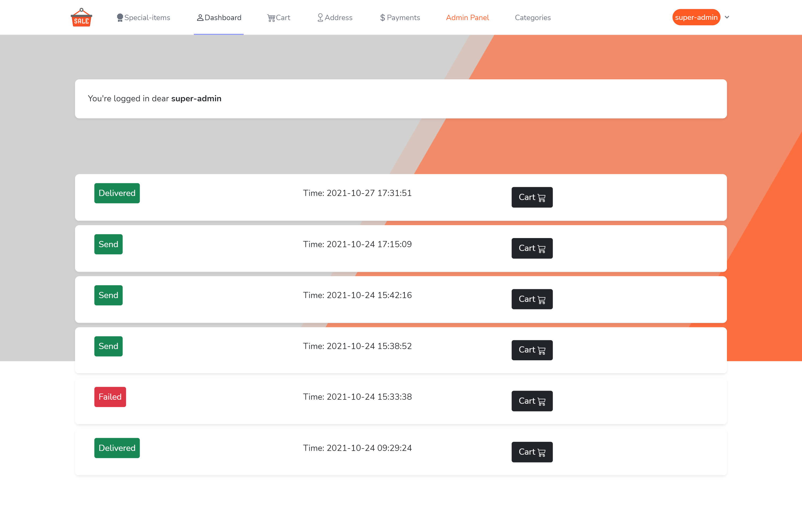

# WooCommerce Website

This is my ```PHP/Laravel``` internship final project. In this project I implemented
a full woocommerce website with ```PHP```, ```MySQL``` and ```Blade```.

## Website Demo

<p align="center">

<br />
<br />


</p>

## Project requirements and tools

- Laravel 8
- PHP 7
- MySQL 5
- Redis
- HTML 5
- CSS 3
- Bootstrap 5
- Javascript
- Blade

## Website Structure

- WooComers website
- Full access Admin panel
- Notification panel
- User panel

In this project I used software engineering tools to make a laravel website.
Some of the project features are:

- Storage management
- Notifications
- Emails and SMS
- Rest APIs

By using the MVC architecture, I used the Eloquent models and Resource Controllers to create my routes and models. 
And for the view parts I used the simple Blade templating.

## Project Tech Features

- Eloquent models
- Authentication
- Gate and Policy
- Resource Controllers
- Middlewares
- Service Providers
- Enums
- Jobs and Queue
- Observers
- Blade Components
- Exceptions
- Files and Storage
- API
- Resource and Collections
- View routes
- Resource routes
- Form requests
- Seeder and Factory
- SQL Migrations
- Js Axios
- jQuery
- DOM

## How to run project

First clone into the repository:

```shell
git clone https://github.com/amirhnajafiz/Online-Shop.git
```

Then go into the root directory of the project:

```shell
cd app
```

Now reload the composer:

```shell
composer dump
```

Now create the database and set ```.env``` file based on your information and system.
Now run the database migrations:

```shell
php artisan migrate --seed --step
```

Ok now we need to set up the ```font-end```:

```shell
npm i & npm run dev
```

After that enter the following command to start the ```server```:

```shell
php artisan serve
```

If you get something like this, then you are good to go:

```shell
Starting Laravel development server: http://127.0.0.1:8000
[Wed Oct 27 20:53:24 2021] PHP 8.0.7 Development Server (http://127.0.0.1:8000) started
```

## Special Tanks

- Special thanks to ```M54 Bootcamp```.
- And my dear master, ```Mr.Ehsan Kashfi```.
- Also special thanks to my lovely mentor ```Mr.Omid KheirAbadi```.

### Date

Amirhossein Najafizadeh, 27th October 2021
